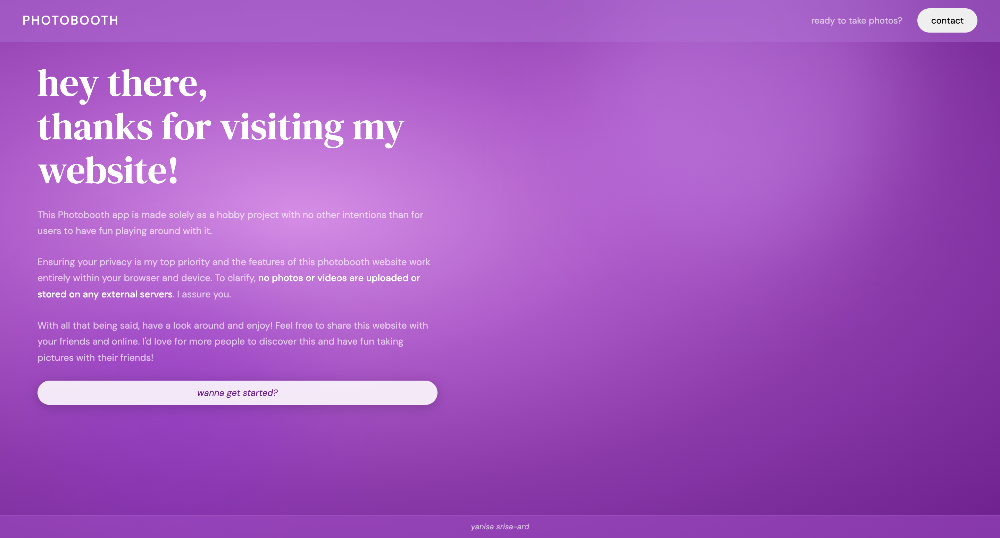

# 📸 Photobooth App

A browser-based photobooth that lets you take selfies, arrange them into a photostrip, add tint and frame colors, and download the result — all without uploading a single pixel to any server.

[**TRY IT YOURSELF →**](https://yanisa-photobooth.netlify.app)



---

## ✨ Features

### Taking Photos
- **Hand-wave detection** — Wave your hand in front of the camera to trigger a 3-second countdown. No buttons needed.
- **Automatic crop** — Photos are captured at the exact aspect ratio of your chosen layout, so nothing gets stretched or letterboxed.
- **Flash effect** — A brief white flash confirms each capture.
- **Fallback button** — If MediaPipe fails to load, a manual shutter button appears automatically.

### Layout & Strip
- **2, 3, or 4 photos** — Choose how many shots go on your strip.
- **Portrait or landscape** — Toggle between orientations; the camera frame and strip dimensions update in real time to match.
- **Photo selection** — After shooting, pick which frames you want on your strip. Unselected photos are discarded.

### Download Page Editing
- **Image tint** — Overlay a colour tint on all photos with adjustable opacity (0–100%).
- **Greyscale toggle** — Convert photos to black-and-white with one click.
- **Frame color** — Pick any colour for the strip border using a full HSV colour picker.
- **QR code** — The website's QR code is automatically stamped in the bottom-right corner of every downloaded strip.
- **Download** — Saves a full-resolution PNG to your device.

### Privacy
No photos or videos are uploaded or stored anywhere. Everything runs entirely in your browser.

---

## 🛠️ Tech Stack

- **HTML5 / CSS3 / Vanilla JavaScript** — No frameworks, no build step
- **MediaPipe Hands** — Google's on-device ML hand-landmark model for gesture detection
- **Canvas API** — Photo capture with cover-crop, greyscale conversion, tint overlay, and QR compositing
- **EmailJS** — Contact form submissions without a backend
- **Google Fonts** — DM Serif Display (headings) + DM Sans (body)

---

## 📁 File Structure

```
/
├── index.html          # All page markup (landing, contact, layout, camera, choose, download)
├── photobooth.css      # All styles + media queries (desktop, tablet, phone)
├── photobooth.js       # All logic: navigation, camera, MediaPipe, strip rendering, download
└── qr.jpg              # QR code stamped onto downloaded strips
```

---

## 🎬 How It Works

### Hand Wave Detection

MediaPipe Hands tracks the index fingertip (landmark 8) at ~10 fps. A wave is detected when:
- A 12-frame rolling buffer of X positions shows **≥ 2 direction reversals**, and
- The total horizontal swing across the buffer is **≥ 10% of frame width**

After a wave is detected, a 3-second countdown runs before the photo is taken. Wave detection is re-armed once the countdown completes.

### Photo Capture

Photos are captured onto an offscreen `<canvas>` at `base = 640px`, using `getSlotDims()` — a shared formula that computes exact slot dimensions for any count/orientation combination:

```js
function getSlotDims(count, orientation, base) {
  const gap = 10;
  if (orientation === 'portrait') {
    const slotW = base;
    const slotH = Math.floor((slotW * 3 - gap * (count - 1)) / count);
    return { slotW, slotH, gap };
  } else {
    const slotH = base;
    const slotW = Math.floor((slotH * 3 - gap * (count - 1)) / count);
    return { slotW, slotH, gap };
  }
}
```

The same function is called with different `base` values across the app:
| Context | Base | Purpose |
|---------|------|---------|
| Layout preview thumbnail | 160px | Small strip preview in the picker |
| Camera viewport aspect ratio | 160px | Sets `aspect-ratio` CSS on the live video frame |
| Photo capture | 640px | Full-resolution shot stored in memory |
| Choose page strip preview | 130px | Small strip with selected photos |
| Final canvas (download) | 320px | High-quality output PNG |

### Cover-Crop

All photo rendering (capture, strip preview, final canvas) uses a cover-crop algorithm so images always fill their slot without distortion:

```js
const srcAR = img.naturalWidth / img.naturalHeight;
const dstAR = slotW / slotH;
let sx = 0, sy = 0, sw = img.naturalWidth, sh = img.naturalHeight;
if (srcAR > dstAR) { sw = sh * dstAR; sx = (img.naturalWidth - sw) / 2; }
else               { sh = sw / dstAR; sy = (img.naturalHeight - sh) / 2; }
ctx.drawImage(img, sx, sy, sw, sh, x, y, slotW, slotH);
```

### Greyscale Conversion

Applied via an offscreen canvas pixel-loop using the luminance formula:

```js
const grey = 0.299 * r + 0.587 * g + 0.114 * b;
```

---

## 📐 Responsive Layout

| Breakpoint | Layout |
|------------|--------|
| > 1024px | All pages use full two-column or three-column layouts |
| ≤ 1024px | Slight padding/spacing reductions; color pickers narrow |
| ≤ 900px | Download page: strip moves to top, both pickers sit side-by-side below |
| ≤ 768px | Layout + choose pages collapse to single column; nav link hidden |
| ≤ 480px | Font sizes reduce; download buttons stack; photo grid switches to 2 columns |

---

## 🚀 Deployment

Deployed on Netlify. No build step required — open `index.html` directly in a browser (camera permission required).

---

## 👩‍💻 Author

**Yanisa Srisa-ard**
- Portfolio: [yanisa.netlify.app](https://yanisa.netlify.app)
- GitHub: [@yanisasri](https://github.com/yanisasri)
- LinkedIn: [linkedin.com/in/yanisa](https://linkedin.com/in/yanisa)

---

## 🙏 Acknowledgments

- Hand detection powered by [MediaPipe Hands](https://developers.google.com/mediapipe/solutions/vision/hand_landmarker) (Google)
- Contact form via [EmailJS](https://www.emailjs.com/)