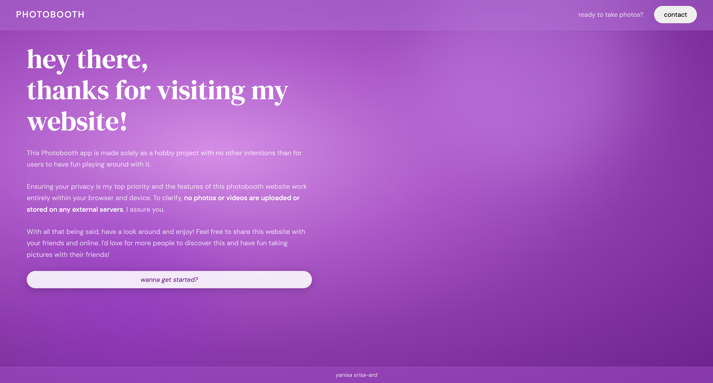

# 📸 Photobooth App

A browser-based photobooth that lets you take selfies, arrange them into a photostrip, add tint and frame colors, and download the result — all without uploading a single pixel to any server. Now with a long-distance duo mode, "inspos for friends" gen z meme themes, and short video downloads of the whole process.

[**TRY IT YOURSELF →**](https://yanisa-photobooth.netlify.app)



---

## ✨ Features

### Taking Photos
- **Hand-wave detection** — Wave your hand in front of the camera to trigger a 3-second countdown. No buttons needed.
- **Automatic crop** — Photos are captured at the exact aspect ratio of your chosen layout, so nothing gets stretched or letterboxed.
- **Flash effect** — A brief white flash confirms each capture.
- **Fallback button** — If MediaPipe fails to load, a manual shutter button appears automatically.

### Layout & Strip
- **2, 3, or 4 photos** — Choose how many shots go on your strip.
- **Portrait or landscape** — Toggle between orientations; the camera frame and strip dimensions update in real time to match.
- **Photo selection** — After shooting, pick which frames you want on your strip. Unselected photos are discarded.

### 👯 Long-Distance Duo Mode
Take a strip together with a friend, wherever they are — no accounts, no app installs, nothing stored on a server.
- **Share a code** — One person creates a room (a short 5-character code) and shares it; the other joins with that code. The two browsers connect directly to each other over WebRTC ([PeerJS](https://peerjs.com/)) — PeerJS's free public broker is only used to help the two browsers find each other, everything else (cursors, photos, chat of sorts) flows peer‑to‑peer and is never stored anywhere.
- **Two live cursors** — Each person's mouse is rendered as a labeled cursor (yours + your friend's name) visible across the whole session, so it always feels like you're in the same room.
- **Split photo strip** — Each person takes their own photos on their own camera; the final strip is split into two sides — yours and theirs — combined into one downloadable image.
- **Synced layout & style** — Whoever creates the room picks the photo count/orientation for both of you; frame color, tint, and greyscale choices are kept in sync too.
- **Known limitation** — the video strip download (see below) is per-person only in duo mode; each of you downloads your own strip rather than a merged one.

### ✨ Inspos For Friends (gen z meme recreations)
Right on the layout page is a "need inspo for what poses to do?" panel with theme cards to choose from. It's completely optional and independent of long-distance duo mode and of your photo count/orientation choices, which work exactly as usual:
- **Three themes** — surprise general memes, gibraltar monkey memes, and spongebob & patrick duo memes — each shown as a card with a small preview mosaic.
- **Always random** — once a theme is picked, a random image from it is shown next to the camera for every photo, re-rolling after each shot. That reference box automatically matches the shape (landscape/square/portrait) of your chosen layout's photo slots.
- **Side-by-side comparison** — when you choose which photos go on your strip, the preview (and the final download) shows your strip right next to the exact memes you were shown for each of those shots — side by side in portrait, stacked top/bottom in landscape. No labels or headers are drawn on top of the strip itself, so it stays clean.
- Reference images live in [`images/inspo/`](images/inspo/README.md) — drop your own images in there and add the filename to `inspo.js`'s theme list to make them show up.

### 🎥 Video Strip Downloads
Every photo capture also records a very short video clip of "the process" (the last second of the countdown through the flash). On the download page, hitting **🎬 make video strip** composites those clips into a single video laid out exactly like your photo strip — each clip loops in its own slot for 15 seconds, with your current frame color/tint/greyscale baked in — so you get both:
- **download photo** — the full-resolution PNG strip, same as before.
- **download video** — the composited, looping video strip, downloaded as `.mp4` on browsers that support MP4 recording (most current browsers) or `.webm` otherwise.

If a photo's clip failed to record for some reason, that slot falls back to showing the still photo instead of leaving a gap.

### Download Page Editing
- **Image tint** — Overlay a colour tint on all photos with adjustable opacity (0–100%).
- **Greyscale toggle** — Convert photos to black-and-white with one click.
- **Frame color** — Pick any colour for the strip border using a full HSV colour picker.
- **QR code** — The website's QR code is automatically stamped in the bottom-right corner of every downloaded strip.
- **Download** — Saves a full-resolution PNG, and (once generated) a looping video-strip file, to your device.

### Privacy
No photos or videos are uploaded or stored on any server we run. Duo mode's cursor/photo/style data travels directly between the two participants' browsers over a WebRTC connection — PeerJS's public broker only helps the two browsers find each other and never sees your photos.

---

## 🛠️ Tech Stack

- **HTML5 / CSS3 / Vanilla JavaScript** — No frameworks, no build step
- **MediaPipe Hands** — Google's on-device ML hand-landmark model for gesture detection
- **Canvas API** — Photo capture with cover-crop, greyscale conversion, tint overlay, and QR compositing
- **MediaRecorder API** — Records a short clip around every photo capture, and again to capture the composited video-strip canvas as a single MP4/WebM download
- **PeerJS / WebRTC** — Peer-to-peer connection powering long-distance duo mode (cursors, photo sync, style sync)
- **EmailJS** — Contact form submissions without a backend
- **Google Fonts** — DM Serif Display (headings) + DM Sans (body)

---

## 📁 File Structure

```
/
├── index.html          # All page markup (landing, duo setup, contact, layout, camera, choose, download)
├── photobooth.css      # All styles + media queries (desktop, tablet, phone)
├── photobooth.js       # Core logic: navigation, camera, MediaPipe, strip rendering, download
├── duo.js              # Long-distance duo mode: PeerJS session, cursors, sync protocol, split strip
├── inspo.js            # Inspos for friends: theme picker, random reference per photo, comparison strip
├── video.js            # Per-photo video recording, clip combining, video download
├── images/inspo/       # Meme reference images (see images/inspo/README.md for expected filenames)
└── qr.jpg              # QR code stamped onto downloaded strips
```

---

## 🎬 How It Works

### Hand Wave Detection

MediaPipe Hands tracks the index fingertip (landmark 8) at ~10 fps. A wave is detected when:
- A 12-frame rolling buffer of X positions shows **≥ 2 direction reversals**, and
- The total horizontal swing across the buffer is **≥ 10% of frame width**

After a wave is detected, a 3-second countdown runs before the photo is taken. Wave detection is re-armed once the countdown completes.

### Photo Capture

Photos are captured onto an offscreen `<canvas>` at `base = 640px`, using `getSlotDims()` — a shared formula that computes exact slot dimensions for any count/orientation combination:

```js
function getSlotDims(count, orientation, base) {
  const gap = 10;
  if (orientation === 'portrait') {
    const slotW = base;
    const slotH = Math.floor((slotW * 3 - gap * (count - 1)) / count);
    return { slotW, slotH, gap };
  } else {
    const slotH = base;
    const slotW = Math.floor((slotH * 3 - gap * (count - 1)) / count);
    return { slotW, slotH, gap };
  }
}
```

The same function is called with different `base` values across the app:
| Context | Base | Purpose |
|---------|------|---------|
| Layout preview thumbnail | 160px | Small strip preview in the picker |
| Camera viewport aspect ratio | 160px | Sets `aspect-ratio` CSS on the live video frame |
| Photo capture | 640px | Full-resolution shot stored in memory |
| Choose page strip preview | 130px | Small strip with selected photos |
| Final canvas (download) | 320px | High-quality output PNG |

### Cover-Crop

All photo rendering (capture, strip preview, final canvas) uses a cover-crop algorithm so images always fill their slot without distortion:

```js
const srcAR = img.naturalWidth / img.naturalHeight;
const dstAR = slotW / slotH;
let sx = 0, sy = 0, sw = img.naturalWidth, sh = img.naturalHeight;
if (srcAR > dstAR) { sw = sh * dstAR; sx = (img.naturalWidth - sw) / 2; }
else               { sh = sw / dstAR; sy = (img.naturalHeight - sh) / 2; }
ctx.drawImage(img, sx, sy, sw, sh, x, y, slotW, slotH);
```

### Greyscale Conversion

Applied via an offscreen canvas pixel-loop using the luminance formula:

```js
const grey = 0.299 * r + 0.587 * g + 0.114 * b;
```

### Long-Distance Duo Mode

1. **Room codes** — the host generates a random 5-character code and creates a `Peer` with that code as its ID; the guest creates its own (anonymous) `Peer` and calls `peer.connect(code)`. Once the resulting `DataConnection` opens, the two browsers can send each other JSON messages directly.
2. **Cursors** — each browser listens for local `mousemove` and renders its own labeled cursor immediately, while also throttling (~25/sec) normalized `{x, y}` coordinates to the other peer, who renders them as the "friend" cursor.
3. **Capturing** — each person's camera and countdown work exactly like solo mode; a small `{type: 'progress'}` message keeps each side aware of how many photos the other has taken.
4. **Choosing & combining** — once both people finish picking their photos, each sends their chosen images (plus their current frame/tint/greyscale settings) to the other. The download page then renders a two-column (or two-row, in landscape) strip — your photos on one side, your friend's on the other, each labeled with your names.
5. **Style sync** — changing the frame color, tint, or greyscale toggle broadcasts the new setting to your friend so both downloads end up matching.

### Inspos For Friends

Picking a theme just sets which folder of images to draw from — it doesn't touch your layout choice at all. Every time a photo is captured, `photoInspoRefs[photoIndex]` records exactly which meme image was on screen for that shot, then a new random one is picked for the next photo. When you get to the choose page, `renderStripPreviewInspo()` builds two strip columns (or rows) side by side: your chosen photos, and — using those same recorded refs — the matching memes, in the same order. The final download reuses the same pairing logic on a `<canvas>` via `renderFinalCanvasInspo()`, so the side-by-side comparison you previewed is exactly what gets saved.

### Video Strip Downloads

A `MediaRecorder` is started right as each countdown hits "1" and stopped shortly after the flash, producing one short clip per photo. On the download page, hitting "make video strip" builds an offscreen `<canvas>` sized exactly like the photo strip, plays each chosen clip (muted, looping) in its own hidden `<video>` element, and redraws all of them into their slots every animation frame — including the current frame color, tint, and greyscale filter. `canvas.captureStream(20)` feeds that into a second `MediaRecorder` for a fixed 15 seconds, and the result is offered as a download. Modern browsers can record directly to `video/mp4`; older ones fall back to `video/webm`.

### Update Banner

The "what's new" banner at the top of the page is intentionally stateless — it always shows on page load and only hides for the current view once you dismiss it (nothing is written to `localStorage`), so it reappears next time you reload.

---

## 📐 Responsive Layout

| Breakpoint | Layout |
|------------|--------|
| > 1024px | All pages use full two-column or three-column layouts |
| ≤ 1024px | Slight padding/spacing reductions; color pickers narrow |
| ≤ 900px | Download page: strip moves to top, both pickers sit side-by-side below |
| ≤ 768px | Layout + choose pages collapse to single column; nav link hidden |
| ≤ 480px | Font sizes reduce; download buttons stack; photo grid switches to 2 columns |

---

## 🚀 Deployment

Deployed on Netlify. No build step required — open `index.html` directly in a browser (camera permission required).

---

## 👩‍💻 Author

**Yanisa Srisa-ard**
- Portfolio: [yanisa.netlify.app](https://yanisa.netlify.app)
- GitHub: [@yanisasri](https://github.com/yanisasri)
- LinkedIn: [linkedin.com/in/yanisa](https://linkedin.com/in/yanisa)

---

## 🙏 Acknowledgments

- Hand detection powered by [MediaPipe Hands](https://developers.google.com/mediapipe/solutions/vision/hand_landmarker) (Google)
- Contact form via [EmailJS](https://www.emailjs.com/)
- Memes taken from the internet. Not claiming any to be mine. Please contact me if you would like anything taken down. 